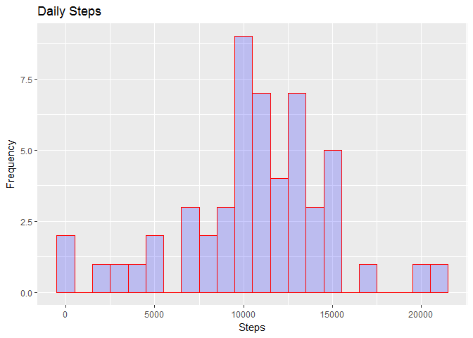
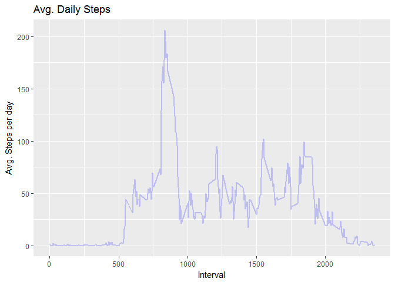
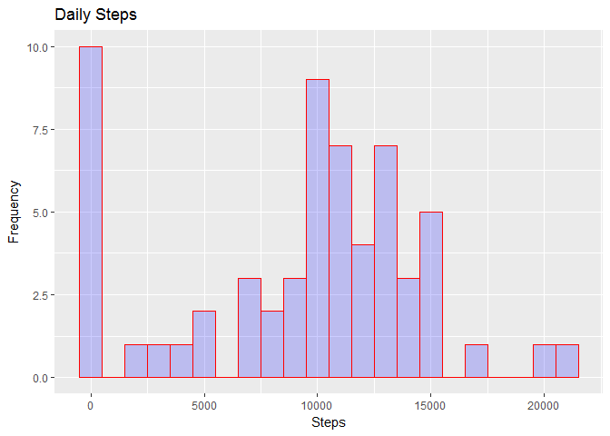
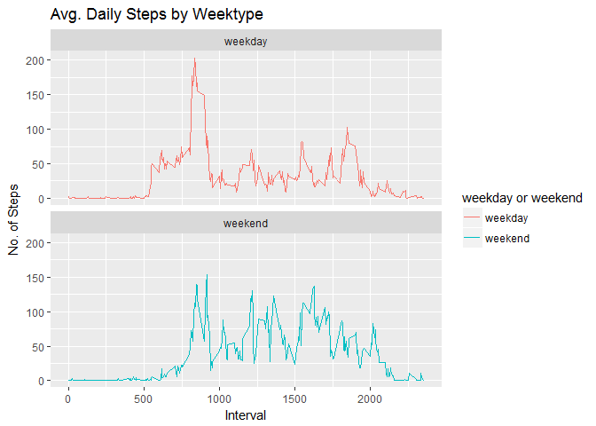

Loading and preprocessing the data
----------------------------------

    library(data.table)

    ## Warning: package 'data.table' was built under R version 3.2.5

    unzip(zipfile="activity.zip")
    data <- data.table::fread(input="activity.csv")

Summarize Data
--------------

head(data) dim(data) summary(data)

What is mean total number of steps taken per day?
-------------------------------------------------

    library(ggplot2)

    ## Warning: package 'ggplot2' was built under R version 3.2.5

    Total_Steps <- data[, c(lapply(.SD, sum, na.rm = FALSE)), .SDcols = c("steps"), by = .(date)]
    ggplot(Total_Steps, aes(x = steps)) + 
             geom_histogram(col="red", 
                          fill="blue", 
                          alpha = .2, 
                          binwidth = 1000) +
             labs(title = "Daily Steps", x = "Steps", y = "Frequency")

    ## Warning: Removed 8 rows containing non-finite values (stat_bin).

    Total_Steps[, .(Mean_Steps = mean(steps, na.rm = TRUE), Median_Steps = median(steps, na.rm = TRUE))]

    ##    Mean_Steps Median_Steps
    ## 1:   10766.19        10765

What is the average daily activity pattern?
-------------------------------------------

    IntervalDT <- data[, c(lapply(.SD, mean, na.rm = TRUE)), .SDcols = c("steps"), by = .(interval)] 

    ggplot(IntervalDT, aes(x = interval , y = steps)) + geom_line(color="blue", alpha = .2, size=1) + labs(title = "Avg. Daily Steps", x = "Interval", y = "Avg. Steps per day")

On average across all the days in the dataset, the 5-minute interval
contains the maximum number of steps?

    IntervalDT[steps == max(steps), .(max_interval = interval)]

    ##    max_interval
    ## 1:          835

Inputing missing values
-----------------------

There are many days/intervals where there are missing values (coded as
NA). The presence of missing days may introduce bias into some
calculations or summaries of the data.

    data[is.na(steps), .N ]

    ## [1] 2304

Fill in missing values
----------------------

All of the missing values are filled in with mean value for that
5-minute interval.

    data[is.na(steps), "steps"] <- data[, c(lapply(.SD, median, na.rm = TRUE)), .SDcols = c("steps")]

rewrite the data table
----------------------

data.table::fwrite(x = data, file =
"Z:/Documents/Coursera/tidydata.csv", quote = FALSE)

Now, using the filled data set, let's make a histogram of the total
number of steps taken each day and calculate the mean and median total
number of steps.

Daily Steps
-----------

    Total_Steps <- data[, c(lapply(.SD, sum)), .SDcols = c("steps"), by = .(date)] 

Mean and Median of Daily steps
------------------------------

    Total_Steps[, .(Mean_Steps = mean(steps), Median_Steps = median(steps))]

    ##    Mean_Steps Median_Steps
    ## 1:    9354.23        10395

Histogram
---------

    ggplot(Total_Steps, aes(x = steps)) + 
      geom_histogram(col="red", 
                     fill="blue", 
                     alpha = .2, 
                     binwidth = 1000) +
      labs(title = "Daily Steps", x = "Steps", y = "Frequency")

Mean and median values are higher after imputing missing data. The
reason is that in the original data, there are some days with steps
values NA for any interval. The total number of steps taken in such days
are set to 0s by default. However, after replacing missing steps values
with the mean steps of associated interval value, these 0 values are
removed from the histogram of total number of steps taken each day.

Are there differences in activity patterns between weekdays and weekends?
-------------------------------------------------------------------------

First, let's find the day of the week for each measurement in the
dataset. In this part, we use the dataset with the filled-in values.

    data <- data.table::fread(input = "Z:/Documents/Coursera/activity.csv")
    data[, date := as.POSIXct(date, format = "%Y-%m-%d")]
    data[, `Day of Week`:= weekdays(x = date)]
    data[grepl(pattern = "Monday|Tuesday|Wednesday|Thursday|Friday", x = `Day of Week`), "weekday or weekend"] <- "weekday"
    data[grepl(pattern = "Saturday|Sunday", x = `Day of Week`), "weekday or weekend"] <- "weekend"
    data[, `weekday or weekend` := as.factor(`weekday or weekend`)]
    head(data, 10)

    ##     steps       date interval Day of Week weekday or weekend
    ##  1:    NA 2012-10-01        0      Monday            weekday
    ##  2:    NA 2012-10-01        5      Monday            weekday
    ##  3:    NA 2012-10-01       10      Monday            weekday
    ##  4:    NA 2012-10-01       15      Monday            weekday
    ##  5:    NA 2012-10-01       20      Monday            weekday
    ##  6:    NA 2012-10-01       25      Monday            weekday
    ##  7:    NA 2012-10-01       30      Monday            weekday
    ##  8:    NA 2012-10-01       35      Monday            weekday
    ##  9:    NA 2012-10-01       40      Monday            weekday
    ## 10:    NA 2012-10-01       45      Monday            weekday

Now, let's make a panel plot containing plots of average number of steps
taken on weekdays and weekends.

panelplot
---------

    data[is.na(steps), "steps"] <- data[, c(lapply(.SD, median, na.rm = TRUE)), .SDcols = c("steps")]
    IntervalDT <- data[, c(lapply(.SD, mean, na.rm = TRUE)), .SDcols = c("steps"), by = .(interval, `weekday or weekend`)] 

    ggplot(IntervalDT , aes(x = interval , y = steps, color=`weekday or weekend`)) + geom_line() + labs(title = "Avg. Daily Steps by Weektype", x = "Interval", y = "No. of Steps") + facet_wrap(~`weekday or weekend` , ncol = 1, nrow=2)

